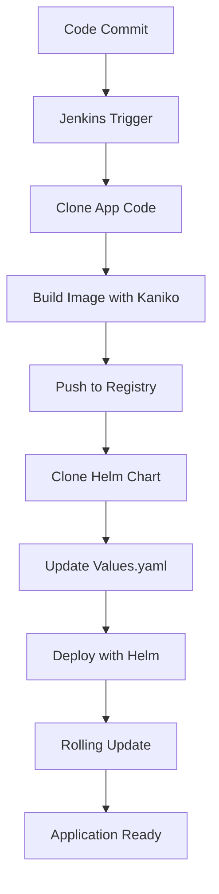

# Snake Game - CI/CD Pipeline

Automated Jenkins pipeline for building, testing, and deploying the Snake Game application to Kubernetes using Kaniko and Helm.

## 🔄 Pipeline Overview

This Jenkins pipeline implements a complete CI/CD workflow with the following capabilities:

- **Containerized Builds**: Uses Kaniko for secure, daemonless Docker image building
- **Kubernetes Native**: Runs on Kubernetes agents with proper RBAC
- **Helm Deployment**: Automated deployment using Helm charts
- **Rolling Updates**: Zero-downtime deployments with rolling update strategy
- **Multi-Stage Process**: Separate stages for build, test, and deployment

## 🏗️ Architecture

### Pipeline Components

```
Jenkins Pipeline
├── Kubernetes Agent Pod
│   ├── Kaniko Container (Image Building)
│   └── Helm Container (Deployment)
├── Docker Hub Registry
├── Kubernetes Cluster
└── Helm Chart Repository
```

### Agent Configuration
- **Platform**: Kubernetes
- **Service Account**: `helm-deployer` with appropriate RBAC permissions
- **Containers**:
  - `kaniko`: `gcr.io/kaniko-project/executor:debug`
  - `helm`: `alpine/helm:3.14.0`

## 📋 Pipeline Stages

### 1. Clone App Code
```groovy
stage('Clone App Code') {
  steps {
    git url: "${APP_REPO}", branch: 'main'
  }
}
```
- Clones the Snake Game application source code
- Uses the repository URL from environment variables

### 2. Build & Push Image (Kaniko)
```groovy
stage('Build & Push Image (Kaniko)') {
  steps {
    container('kaniko') {
      sh '/kaniko/executor --dockerfile=./Dockerfile --context=dir://. --destination=${DOCKER_IMAGE}:${IMAGE_TAG}'
    }
  }
}
```
- Builds Docker image using Kaniko executor
- Pushes to Docker Hub registry
- Tags image with build number for versioning

### 3. Clone Helm Chart
```groovy
stage('Clone Helm Chart') {
  steps {
    container('helm') {
      sh 'git clone ${HELM_REPO}'
    }
  }
}
```
- Clones the Helm chart repository
- Prepares deployment configuration

### 4. Update Helm Values
```groovy
stage('Update Helm values') {
  steps {
    container('helm') {
      sh '''
        sed -i "s|repository:.*|repository: ${DOCKER_IMAGE}|" values.yaml
        sed -i "s|tag:.*|tag: \\"${IMAGE_TAG}\\"|" values.yaml
      '''
    }
  }
}
```
- Updates `values.yaml` with new image repository and tag
- Ensures deployment uses the newly built image

### 5. Deploy with Helm
```groovy
stage('Deploy with Helm') {
  steps {
    container('helm') {
      sh 'helm upgrade --install snake-game . --namespace helm-snake --create-namespace'
    }
  }
}
```
- Deploys or upgrades the application using Helm
- Creates namespace if it doesn't exist
- Implements rolling update strategy

## 🔧 Configuration

### Environment Variables
```groovy
environment {
  DOCKER_IMAGE = 'anurag927/snake-game'
  IMAGE_TAG = "${BUILD_NUMBER}"
  APP_REPO = 'https://github.com/anuragdey123/snake_game-'
  HELM_REPO = 'https://github.com/anuragdey123/snake-game-helm.git'
}
```

### Required Secrets
- `dockerhub-kaniko-secret`: Docker Hub credentials for Kaniko
- Kubernetes service account with deployment permissions

### RBAC Configuration
The pipeline requires a service account (`helm-deployer`) with permissions to:
- Create and manage deployments
- Create and manage services
- Create namespaces
- Access secrets and configmaps

## 🚀 Setup Instructions

### Prerequisites
- Jenkins with Kubernetes plugin
- Kubernetes cluster access
- Docker Hub account
- Helm 3.x

### 1. Configure Kubernetes Cluster
```bash
# Apply RBAC configuration
kubectl apply -f snake-game/role-rolebinding-sa.yaml
```

### 2. Create Docker Hub Secret
```bash
kubectl create secret docker-registry dockerhub-kaniko-secret \
  --docker-server=https://index.docker.io/v1/ \
  --docker-username=<your-username> \
  --docker-password=<your-password> \
  --docker-email=<your-email>
```

### 3. Configure Jenkins Pipeline
1. Create new Pipeline job in Jenkins
2. Configure SCM to point to this repository
3. Set Pipeline script path to `jenkins-ci-cd/snake-game/jenkinsfile`
4. Configure build triggers as needed

### 4. Update Environment Variables
Modify the environment section in the Jenkinsfile:
- `DOCKER_IMAGE`: Your Docker Hub repository
- `APP_REPO`: Your application repository URL
- `HELM_REPO`: Your Helm chart repository URL

## 🔍 Monitoring & Troubleshooting

### Pipeline Monitoring
- **Build Status**: Monitor Jenkins build console output
- **Image Registry**: Verify images are pushed to Docker Hub
- **Kubernetes Deployment**: Check pod status and logs

### Common Issues

**Kaniko Build Failures**
```bash
# Check Kaniko configuration
kubectl logs <kaniko-pod> -c kaniko
# Verify Docker Hub secret
kubectl get secret dockerhub-kaniko-secret -o yaml
```

**Helm Deployment Issues**
```bash
# Check Helm deployment status
helm status snake-game -n helm-snake
# View pod logs
kubectl logs -l app=snake-game -n helm-snake
```

**RBAC Permission Errors**
```bash
# Verify service account permissions
kubectl auth can-i create deployments --as=system:serviceaccount:default:helm-deployer
```

### Debugging Commands
```bash
# Check pipeline pods
kubectl get pods -l agent-label=kaniko-helm-agent

# View pipeline logs
kubectl logs <pod-name> -c kaniko
kubectl logs <pod-name> -c helm

# Check deployed application
kubectl get all -n helm-snake
```

## 🔐 Security Best Practices

### Image Security
- Uses Kaniko for rootless container builds
- Minimal base images to reduce attack surface
- Regular security scanning of base images

### Kubernetes Security
- RBAC with least privilege principle
- Service accounts with limited permissions
- Secrets management for sensitive data

### Pipeline Security
- Secure credential storage in Jenkins
- Environment variable validation
- Build artifact verification

## 📈 Performance Optimization

### Build Optimization
- Multi-stage Docker builds
- Layer caching in Kaniko
- Parallel pipeline execution where possible

### Deployment Optimization
- Rolling updates for zero downtime
- Resource limits and requests
- Health checks for faster rollouts

## 🔄 Pipeline Workflow



## 📝 Maintenance

### Regular Tasks
- Update base images for security patches
- Review and rotate secrets
- Monitor resource usage
- Update Helm chart versions

### Scaling Considerations
- Increase replica count in values.yaml
- Configure horizontal pod autoscaling
- Implement resource quotas
- Set up monitoring and alerting

## 🤝 Contributing

1. Test pipeline changes in development environment
2. Update documentation for any configuration changes
3. Follow security best practices
4. Validate RBAC permissions after changes

## 📞 Support

For pipeline issues:
- Check Jenkins build logs
- Review Kubernetes events: `kubectl get events -n helm-snake`
- Verify service account permissions
- Contact DevOps team for infrastructure issues
